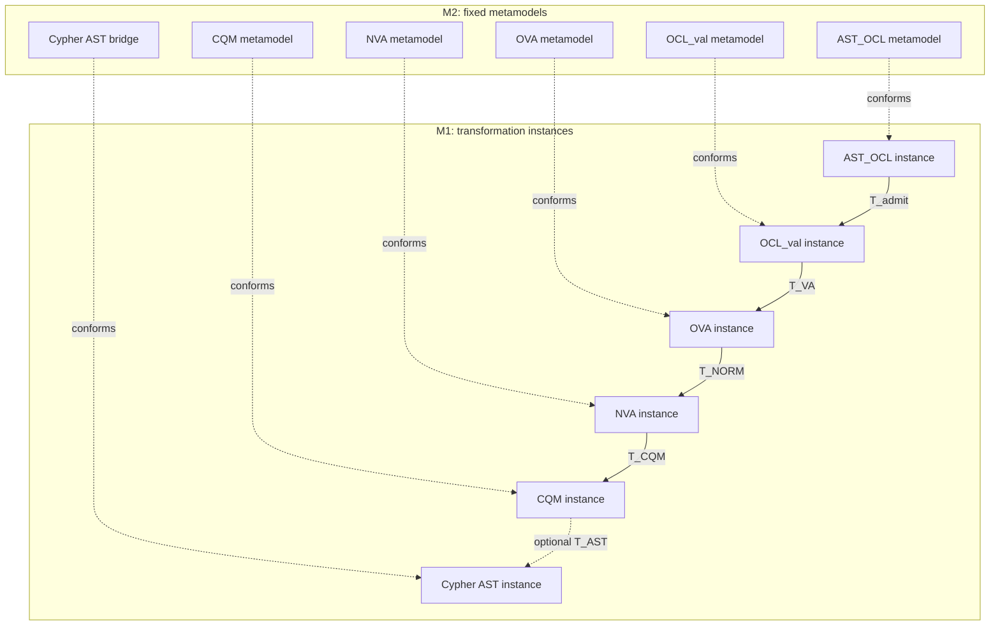
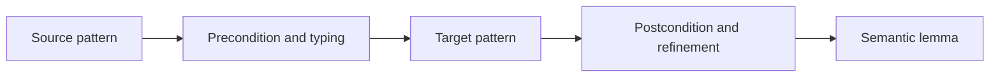
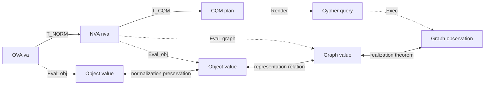

# Specification diagrams

Diagrams communicate the structure; the equations and induction lemmas in the
proof files establish correctness.

## M2 metamodels and M1 instances

## Rule shape

## Semantic commuting diagram

