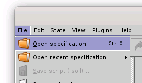
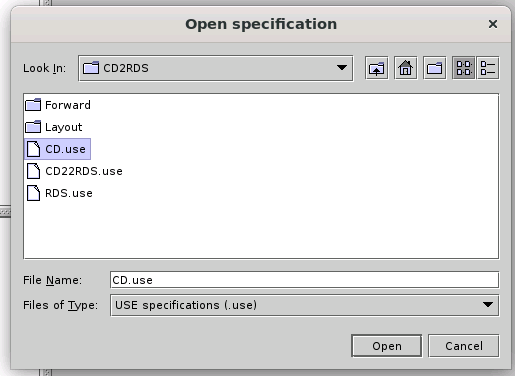
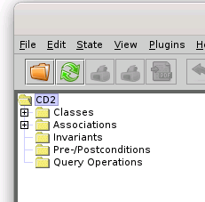
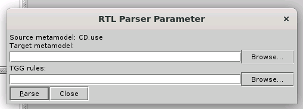
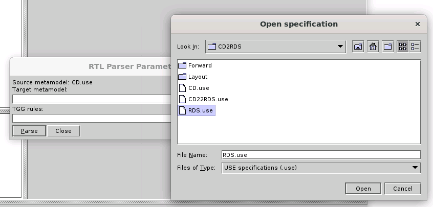
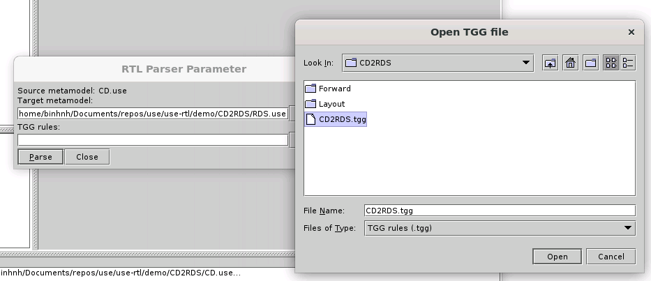

# CD2RDS example evaluation guide

## Prerequisites

Before any example evaluation, RTL plugin must be installed along with USE. See [installation process](../../README.md#building-artifact-and-installation).

## Evaluation

RTL is a model transformation language, you needs one or more `source model`, some `transformation rules` to transform `source model` to `target model`.
1. This plugin, `use-rtl` inherently transform models from USE project. So the first step is load the source model. In this example, as state in the `CD2RDS` name, the source model is `CD`, which is specified in `CD.use` file. You have to load `CD.use` into USE first:

- Select `Open specification` button under `File` menu or you can use `Open specification` button right in the toolbar.

- Choose `CD.use` from popped up dialog:

A successful model load should look like this:

2. After the source model is successfully loaded, you will have to load target model and transformation rule. In this example, the target model is `RDS`, with the same logic, it should be specified in `RDS.use` file, and the transformation rule is `CD2RDS` which is specified in `CD2RDS.tgg` file:

- Select `RTL Parser` button under `Plugins/RTL Plugin` menu:

- The target model and rule import interface should look like this:

- Hit `Browse` button next to `Target metamodel` textbox to choose target model file, choose `RDS.use` from popped up dialog:

- Hit `Browse` button next to `TGG rules` textbox to choose the transformation rules file, choose `CD2RDS.tgg` from popped up dialog:

- Hit `Parse` button to perform transformation.